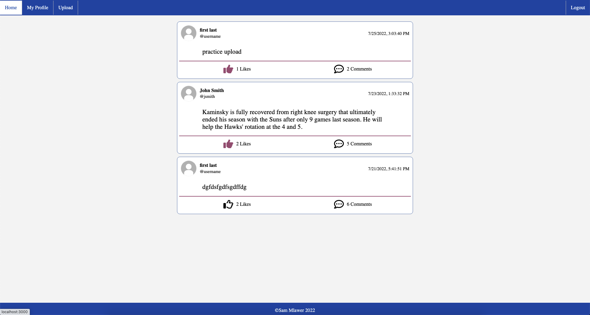

# social-media-app

<!-- PROJECT DESCRIPTION -->
## Project Description:

 
This is a social media app where users can create accounts, upload short text, and view and interact with other user's uploads. This project is my first full stack project and I used to practice getting a frontend and background that work well together. It is also my first time using react router dom to create multiple pages that users can move between adn my first time using basic localstorage authentication so users can store log ins.

### Built With
* [![React][React.js]][React-url]
* [![Express][Express.js]][Express-url]

## Future Changes:

1. Use JWT for more security
2. Encrypt passwords stored to database
3. More complex password requirements
4. Search for other users/posts
5. Upload pictures
6. Change profile picture
7. More customizable personal pages

<!-- MARKDOWN LINKS & IMAGES -->
[React.js]: https://img.shields.io/badge/React-20232A?style=for-the-badge&logo=react&logoColor=61DAFB
[React-url]: https://reactjs.org/
[Express.js]: https://img.shields.io/badge/Express-20232A?style=for-the-badge&logo=data%3Aimage%2Fpng%3Bbase64%2CiVBORw0KGgoAAAANSUhEUgAAACAAAAAUCAMAAADbT899AAACEFBMVEUAAAAzMzM0NDQkJCQzMzMzMzMyMjI2NjY0NDQzMzNgnVRUlU8xMTExMTErKysyMjI3NzdVVVUzMzMzMzMzMzMzMzNYpEVnrlFallJQj1AzMzMzMzMyMjIzMzMzMzM0NDQAAAA0NDQ0NDRao0pknVhEiEQvLy8zMzMzMzMzMzM0NDQzMzMzMzNXlk4%2Fhj8zMzMzMzMzMzMzMzMzMzNBTT8yMjIzMzMzMzM0NDQ0NDQzMzNXoEpDhj9AQEA0NDQ8RTpon2NKY0g0NDQ2NjZXpUVMj0gzMzM1NTUzMzNQbE0zMzMzMzMzMzMzMzNLmkFDiD9Ii0M0NDQzMzMzMzMzMzMzMzMzMzMzMzMtLS03NzczMzNImEBDjT5bnFFKlEoA%2FwAzMzMzMzMzMzMyMjIzMzMzMzMyMjJAgEBRmUphplBon2NooGNnnmExMTEzMzMrKysyMjIzMzNmn2Bpn2RpnmFVqlVnn2JpnmNmmWZnn2BpoGOAgIBqoGJnoWJnnmRqoWJqnmdqn2Von2Ron2Jon2NooGJonmRmomFnnmRpn2NmnWJnn2Nnn2Bnn2Nnn2RnnmNpoGNpnWJooGNnoGNxqlVnnmNpnmNpoWRooGNqnGMzMzN2r2NmnVpqvkdzuVZspF5jm1lnt0ltpV9dl1RUk05WoEddmFRIi0VBij9mrFBdmVRFikI%2Bhj1JkkNlolf%2F%2F%2F84ZhkNAAAAmnRSTlMAm3YHq5GdE2MKgjoaOQZWDgNp7eFVQ%2Bm%2BEPP4R9jmXQHLqID6HhvZvb5P0d2cOUGkdPHbasXy%2Fkps3Js5CK1y%2FnG3Jp85d0TESf3rKPSa%2FS4neK76jQ%2BLERx8XPLdJgGm10Zc5e9XBKNZXZYqPmoMZhQtlz8GcoEPJYsERjlZQVQ1hYeaVmk3T1U8r0WIinRLJ45%2BCXl8LpMk%2BCqs3AAAATdJREFUeNqUygNixUAAhOFJatu2bdu2jUPN1vYZuyie8SfrDx6z7BD4LJRh%2FkB4MCAiMgq66BizxsYZEJ%2BQCCApOYWpaQDSM8RFZpa8trOZo0BuHvMLClFEVTFKLq%2FE9U1pWXkFZRJYeq0EWVVdw1rU3V6Ju%2FuH%2BgaysalZghbWtLaxHR3sRBe70fMowdNzrwR96NdgYHBoeOQPjL68iru39zEJxidSNZicgmx6ZhYNcy2Y%2F%2FiUYGFxKZuqZayQq2vrwMamVFvbwM7u193e%2FgHKDzt4dAwUnpzy7BwOfS89IzM%2BKzs7hyE3jw8skF9QiBaARcUlDKVl5RWVuEK4qrqmtqquvqERl4ImhuaW1rb2DgY8Cjq7untwK6gq7a3p6%2B%2BZgFPBxEmTGaZMnVaKJyFML54xE1UEACNuaoDM4B3WAAAAAElFTkSuQmCC&logoColor=61DAFB
[Express-url]: https://expressjs.com/
